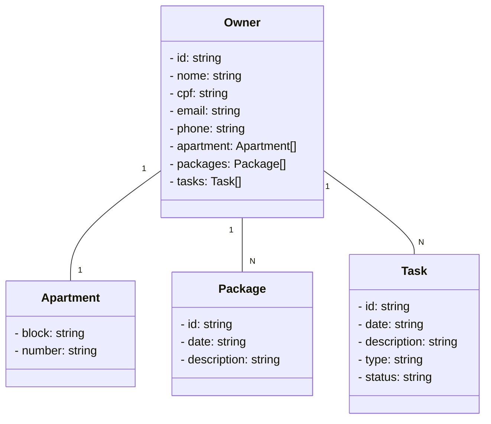

# Java-API-DevWeek-Santander

API responsavel por cadastro e consulta de entregas para moradores de um condomínio

<h2>Diagrama de Classes</h2>

```mermaid
classDiagram
  class Owner {
    - id: string
    - nome: string
    - cpf: string
    - email: string
    - phone: string
    - apartment: Apartment[]
    - packages: Package[]
    - tasks: Task[]
  }
  
  class Apartment {
    - block: string
    - number: string
  }
  
  class Package {
    - id: string
    - date: string
    - description: string
  }
  
  class Task {
    - id: string
    - date: string
    - description: string
    - type: string
    - status: string
  }
  
  Owner "1" -- "1" Apartment 
  Owner "1" -- "N" Package 
  Owner "1" -- "N" Task 
```
